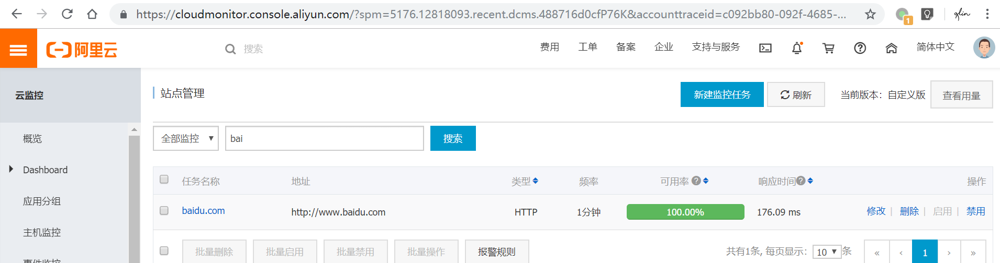
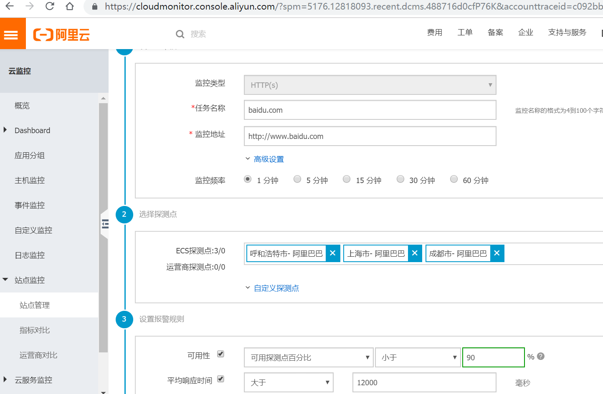
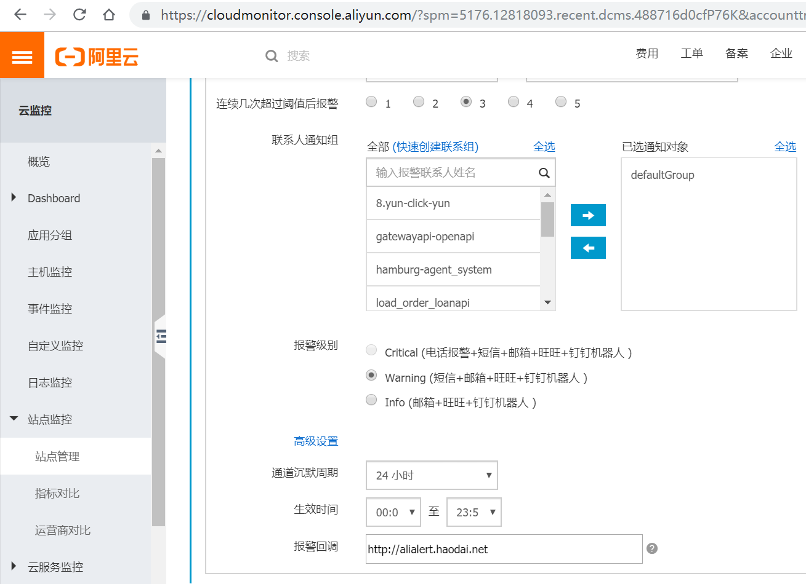

# site-monitor-operator
Aliyun site monitor operator

## Install

> update deploy/operator.yaml.example, add accesskey and access secrets.
> mv operator.yaml.example operator.yaml

```shell
cd deploy
kubectl apply -f .
cd crds
kubectl apply -f .
```

## Example usage


```yaml
kubectl apply -f - <<eof
apiVersion: sitemonitor.haodai.com/v1alpha1
kind: SiteMonitor
metadata:
  name: baidu.com
spec:
  TaskName: baidu.com
  TaskType: HTTP 
  HttpMethod: get  
  Timeout: 1000     
  Interval: 1    
  Address: http://www.baidu.com     
  TaskState: true  # default to true
  ContactGroups: defaultGroup  # must exist
eof


kubectl get sitemonitor
```

```yaml
$ kubectl get sitemonitor
NAME        AGE
baidu.com   14s
$ kubectl get sitemonitor -o yaml
apiVersion: v1
items:
- apiVersion: sitemonitor.haodai.com/v1alpha1
  kind: SiteMonitor
  metadata:
    annotations:
      kubectl.kubernetes.io/last-applied-configuration: |
        {"apiVersion":"sitemonitor.haodai.com/v1alpha1","kind":"SiteMonitor","metadata":{"annotations":{},"name":"baidu.com","namespace":"default"},"spec":{"Address":"http://www.baidu.com","ContactGroups":"defaultGroup","HttpMethod":"get","Interval":1,"TaskName":"baidu.com","TaskState":true,"TaskType":"HTTP","Timeout":1000}}
    creationTimestamp: "2019-08-07T07:37:15Z"
    finalizers:
    - finalizer.sitemonitor.haodai.com
    generation: 1
    name: baidu.com
    namespace: default
    resourceVersion: "3253043"
    selfLink: /apis/sitemonitor.haodai.com/v1alpha1/namespaces/default/sitemonitors/baidu.com
    uid: 2d6c3df9-b8e6-11e9-a106-6e97fdc29d10
  spec:
    Address: http://www.baidu.com
    ContactGroups: defaultGroup
    HttpMethod: get
    Interval: 1
    TaskName: baidu.com
    TaskState: true
    TaskType: HTTP
    Timeout: 1000
  status:
    AlertState: 'ResponseTime: OK, Availability: OK'
    TaskState: true
kind: List
metadata:
  resourceVersion: ""
  selfLink: ""
$ 

$ kubectl delete sitemonitor baidu.com 
sitemonitor.sitemonitor.haodai.com "baidu.com" deleted
$
```

## CloudMonitor UI





